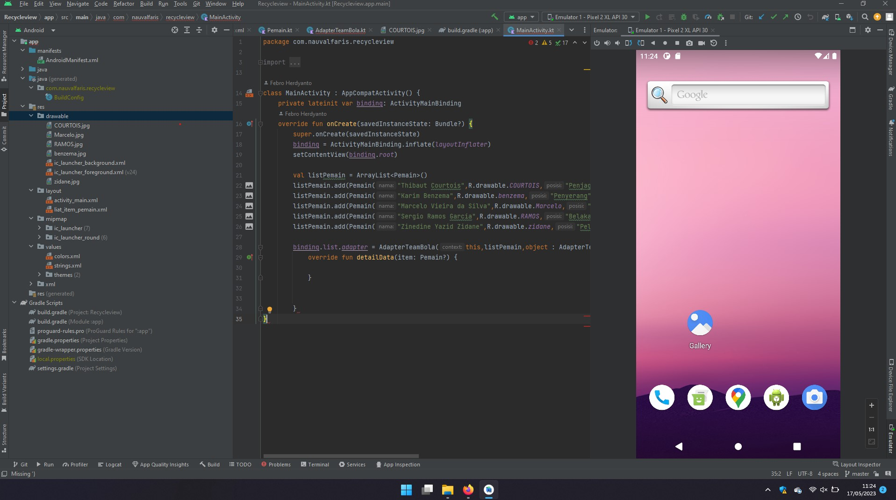
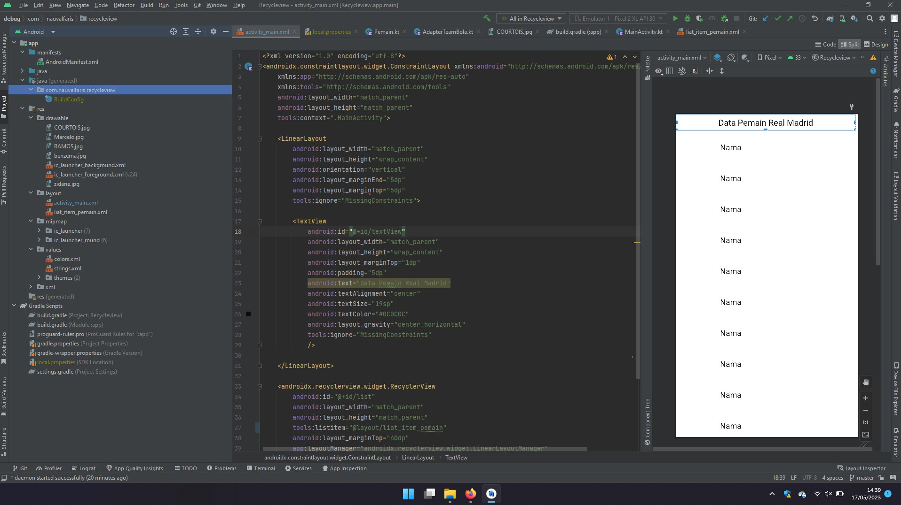

| RECYCLEVIEW | UJUAN TENGAH SEMESTER 6 |
| :---: | :---: |
| NAMA            | *MOCH. NAUVAL FARIS MUZAKI* |
| NIM             | *312010122* |
| KELAS           | *TI.20.B1* |
| MATA KULIAH     | *PEMROGRAMAN MOBILE* | 
 

***TUGAS INI DIBUAT UNTUK MEMENUHI SYARAT UJIAN TENGAH SEMESTER GENAP MATA KULIAH PEMROGRAMAN MOBILE, BERIKUT HASIL RUNNINGNYA***

__Running 1!__
 
__Running 2!__
 
